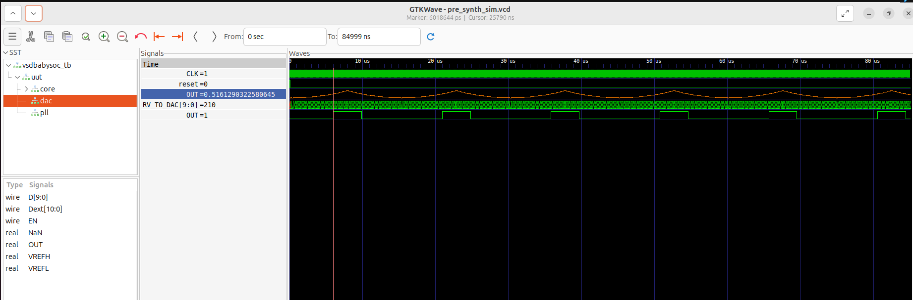

# Part 2 – Labs (Hands-on Functional Modelling)

## 📌 Table of Contents
- [Project Structure](#project-structure)  
- [Software & Tool Requirements](#software--tool-requirements)  
- [Step 1: Setup and Project Directory](#step-1-setup-and-project-directory)  
- [Step 2: VSDBabySoC Module Overview](#step-2-vsdbabysoc-module-overview)  
- [Step 3: Cloning the Repository](#step-3-cloning-the-repository)  
- [Step 4: TLV to Verilog Conversion](#step-4-tlv-to-verilog-conversion)  
- [Step 5: Running Simulations](#step-5-running-simulations)  
- [Step 6: Viewing Results in GTKWave](#step-6-viewing-results-in-gtkwave)  
- [Troubleshooting](#troubleshooting)  

---

## Project Structure
The project uses a modular directory structure:
```bash
VSDBabySoC/
├── src/
│ ├── include/ # Contains macros, parameters, and shared definitions
│ ├── module/ # Verilog sources (CPU, PLL, DAC, testbench, SoC top)
├── output/ # Stores compiled outputs and simulation waveforms
└── compiled_tlv/ # Intermediate TLV-to-Verilog files (optional)
```

- **include/** → Header (`*.vh`) files with macros, constants  
- **module/** → RTL design files (`vsdbabysoc.v`, `rvmyth.v`, `avsdpll.v`, `avsddac.v`, `testbench.v`)  
- **output/** → Folder for executables & `.vcd` files  
- **compiled_tlv/** → Holds TLV compilation intermediates  

---

## Software & Tool Requirements
- **Icarus Verilog (iverilog)** → Compile Verilog RTL and testbenches  
- **GTKWave** → View `.vcd` waveform files  
- **Python 3 + SandPiper-SaaS** → Convert TL-Verilog (`.tlv`) to Verilog (`.v`)  

---

## Step 1: Setup and Project Directory
1. Create workspace:
   ```bash
   cd ~/VLSI
   mkdir VSDBabySoC
   cd VSDBabySoC
   ```
## Step 2: VSDBabySoC Module Overview
🔹 **vsdbabysoc.v – Top-level SoC**
- Integrates CPU, PLL, DAC
- Handles interconnections and clock routing
- Acts as main wrapper module

🔹 **rvmyth.v – RISC-V Core**
- Executes instructions
- Uses r17 register to generate DAC values
- Supplies digital data stream to DAC

🔹 **avsdpll.v – PLL**
- Generates stable and clean clock
- Ensures CPU and DAC operate in sync

🔹 **avsddac.v – DAC**
- Converts 10-bit digital input → analog output
- Produces main output OUT

🔹 **testbench.v**
- Drives CLK and reset signals
- Monitors CPU and DAC outputs
- Dumps simulation data into .vcd

## Step 3: Cloning the Repository

Clone project and check module files:

```bash
git clone https://github.com/manili/VSDBabySoC.git
cd VSDBabySoC
ls src/module/
```

✅ Example Output:
```bash
avsddac.v  avsdpll.v  clk_gate.v  pseudo_rand_gen.sv  
pseudo_rand.sv  rvmyth_gen.v  rvmyth.tlv  testbench.v  
vsdbabysoc.v
```

## Step 4: TLV to Verilog Conversion

1. Create a virtual environment:
  ```bash
  python3 -m venv vsd_env
  source vsd_env/bin/activate
  ```

2. Install SandPiper-SaaS:
  ```bash
  pip install pyyaml click sandpiper-saas
  ```

3. Convert TLV → Verilog:
  ```bash
  sandpiper-saas -i ./src/module/*.tlv -o rvmyth.v --bestsv --noline -p verilog --outdir ./src/module/
  ```

## Step 5: Running Simulations

1. Create output folder:
  ```bash
  mkdir -p output/pre_synth_sim
  ```

2. Compile with Icarus Verilog:
  ```bash
  iverilog -o ~/VLSI/VSDBabySoC/output/pre_synth_sim/pre_synth_sim.out -DPRE_SYNTH_SIM -I ~/VLSI/VSDBabySoC/src/include -I ~/VLSI/VSDBabySoC/src/module ~/VLSI/VSDBabySoC/src/module/testbench.v
  ```

3. Run simulation:
```bash
cd output/pre_synth_sim
./sim.out
```
  👉 Produces pre_synth_sim.vcd file

## Step 6: Viewing Results in GTKWave

Open waveform:
```bash
gtkwave output/pre_synth_sim/pre_synth_sim.vcd
```

Drag the following into viewer:

- `CLK` → clock from PLL
- `reset` → reset signal
- `OUT` → The main output of the VSDBabySoC module.
- `RV_TO_DAC[9:0]` → 10-bit bus feeding DAC
- `OUT` → DAC output


🔧 For analog view:
Right-click OUT → Data Format → Analog → Step → On

  
  
## Troubleshooting
- Redefinition Errors → Ensure each module is included only once
- Path Errors → Use absolute paths if relative ones fail
- Missing rvmyth.v → Repeat TLV to Verilog conversion
- GTKWave empty signals → Ensure .vcd file was generated correctly
